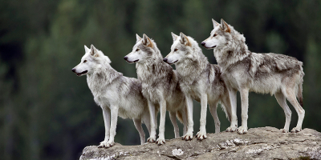
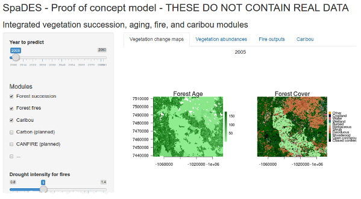

```{r setup, include=FALSE}
knitr::opts_chunk$set(echo = FALSE)
knitr::opts_chunk$set(cache = TRUE)
```

## Examples
 
1. The [demo modules](https://github.com/PredictiveEcology/SpaDES/blob/master/inst/sampleModules/SpaDES_sampleModules/SpaDES_sampleModules.Rmd) in the `SpaDES` package
  
    - [caribouMovement](https://github.com/PredictiveEcology/SpaDES/blob/master/inst/sampleModules/caribouMovement/caribouMovement.R)  
    - [fireSpread](https://github.com/PredictiveEcology/SpaDES/blob/master/inst/sampleModules/fireSpread/fireSpread.R)  
    - [randomLandscapes](https://github.com/PredictiveEcology/SpaDES/blob/master/inst/sampleModules/randomLandscapes/randomLandscapes.R)  
            
2. Land Cover Classification 2005 model ([LCC2005](http://htmlpreview.github.io/?https://github.com/PredictiveEcology/SpaDES-modules/blob/master/modules/LCC2005/LCC2005.html))

3. Vegetation simulation (SpaDES-Landis)

4. Agent based models – [wolf IBM](http://htmlpreview.github.io/?https://github.com/PredictiveEcology/SpaDES-modules/blob/master/modules/wolfAlps/wolfAlps.html)

5. A shiny app on shinyapps.io (*e.g.*, [Proof of concept](https://spades.shinyapps.io/ForestChange_ProofOfConcept/))

## 1. Demo modules in SpaDES package

- The [demo modules](https://github.com/PredictiveEcology/SpaDES/blob/development/inst/sampleModules/SpaDES_sampleModules/SpaDES_sampleModules.Rmd) are simple, proof of concept modules.
- There are 3 different types of module

    - Event (fireSpread)
    - Agent (caribouMovement)
    - Data generation (randomLandscapes)
    
- *How to find them:*

```{r SampleModuleFiles, eval=FALSE, echo=TRUE}
# Locate SpaDES on your computer; they are in the sampleModule folder
whereSpaDES <- find.package(package  = "SpaDES")
whereSamples <- system.file('sampleModules', package = 'SpaDES')
file.path(whereSamples, "caribouMovement", "caribouMovement.R") %>%
  file.edit()
```

## 2. Simple forest dynamics model

- More modules than SpaDES demo
- Vegetation component is simple, but data-driven (LCC 2005)
- Neither caribou, nor fire are data-driven
- During simulation, it shows:

    - maps 
    - data summary plots 
    - text legends
    - colour matching between map and histogram
    - modular plotting (each module is unaware of other plots)

## 2. Simple forest dynamics model

- Freely available from the [SpaDES-Modules](http://github.com/PredictiveEcology/SpaDES-Modules) repository
- This repository is intended to be like CRAN, but for `SpaDES` modules
- Makes them easy to distribute to others
- *How to find it:*

```{r LCC2005ModuleFiles, eval=FALSE, echo=TRUE}
# specify where to save files
moduleDir <- file.path(tempdir(), 'SpaDES_modules')

# download all necessary modules
downloadModule('LCC2005', path = moduleDir, data = TRUE)

# look at module or helper .Rmd file
openModules('LCC2005', path = moduleDir) 
```

## 3. SpaDES-Landis Biomass Succession 

- This is a rewrite in R of a core LANDIS vegetation dynamics module
- Slightly different implementation, making it faster under many situations
- Cross-platform (LANDIS is Windows-only)
- Allows scientist easier access to code, *e.g.*, 

    - making growth climate sensitive
    - changing mortality functions
    - dividing up large problems into small parallel problems

- Not yet published
    
## 3. SpaDES-Landis Biomass Succession 

### Example results

- Features:

    - Shows a random location in western boreal forest
    - Uses shiny to make it an interactive web page
    - Shows maps
    - Data summaries
    - Pre-run results
    - Can be easily published online, once public:
    
         (top right)

## 3. SpaDES-Landis Biomass Succession 

### Running the app

```{r LandwebApp, eval=FALSE, echo=TRUE}
shiny::runApp("~/GitHub/LandwebApp/")
```

## 4. Agent-based wolf model

- Demography and dispersal of wolves in the Italian Alps
- R port of the original SELES model that was used in (Marucco and McIntire 2010)
- Freely available from the [SpaDES-Modules](http://github.com/PredictiveEcology/SpaDES-Modules) repository

```{r downloadModule-example, eval=FALSE, echo=TRUE}
downloadModule('wolfAlps', path = moduleDir, data = TRUE)
```

- See [README](https://htmlpreview.github.io/?https://github.com/PredictiveEcology/SpaDES-modules/blob/master/modules/wolfAlps/wolfAlps.html) for information on running the model.

<div class="centered">

</div>

## 5. Proof of concept `shiny` app

https://spades.shinyapps.io/ForestChange_ProofOfConcept/

<div class="centered">

</div>

# How `SpaDES` works

## Basic overview

`SpaDES` is a *discrete event simulator* (DES) oriented around the construction of spatially explicit models and the use of spatial data.

- **events** describe changes in the state of a complex system
- **time** is not modeled in a continuous fashion; we can 'skip ahead' to the next event, speeding up model evaluation
- events are scheduled (added to a queue) dynamically, and executed at their scheduled time

## Modules

`SpaDES` is implemented in a way that facilitates *modularity* of code:

- different (ecological) processes can be grouped into logical units (*modules*)
- a(n) (ecological) model consists of a collection of modules
- each module is responsible for scheduling its own events
- modules interact *indirectly* via shared data objects (*e.g.*, a map);
  module 'A' doesn't need to know what module 'B' is doing

**Thus, modules can be added, removed, or swapped out without needing to recode the rest of the model.**

## Ecological modelling in `SpaDES`

During this workshop we will learn how to:

- break down ecological processes into discrete events;
- organize ecological processes into `SpaDES` modules;
- rapidly prototype and develop complex ecological models in `SpaDES`;
- parameterize and evaluate simulation models;
- perform scenario analyses, *e.g.*, for decision support;
- build portable, reproducible models;
- share models, analyses, and code.

## Where to get help

- package help docs (*e.g.*, [overview of `SpaDES` package](http://www.rdocumentation.org/packages/SpaDES/versions/1.2.0/topics/SpaDES-package)):

```{r help, echo=TRUE, eval=FALSE}
?SpaDES
```

- package vignettes ([link](https://github.com/PredictiveEcology/SpaDES/wiki/Help-Vignettes))
- `SpaDES` wiki ([link](https://github.com/PredictiveEcology/SpaDES/wiki/))
- `SpaDES` user group ([link](https://groups.google.com/d/forum/spades-users))
- bug reports ([link](https://github.com/PredictiveEcology/SpaDES/issues/))
